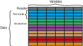
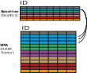

```{r setup, include=FALSE}
knitr::opts_chunk$set(echo = FALSE)
```

## Objectives

- Review the motivating questions
- Introduce you to the structure of EMA data
- Discuss the preparation of the data
- Give an overview of the Analyses

## EMA questions

- Describing state-like variables
    - How does mood fluctuate?
- Relationships among state-like variables
    - Does state affect predict alcohol consumption? 
- Relationships between state and trait-like variables
    - Does gender predict state affect?
  
## Cross-sectional Data


## Longitudinal / Repeated Measures Data

<div align="center">

</div>

## EMA data

- Necessarily contains longitudinal data
- Regularly contains cross-sectional data (baseline measures)
- Both are important to research questions

-----
<div align="center">

</div>


## Reading, Cleaning, and Recoding - Baseline 

```{r baseline, echo = TRUE, warning = FALSE, message = FALSE}
library(readr)
library(dplyr)
library(janitor)
df1 <-  read_csv("baseline.csv") %>% 
  clean_names() %>% 
  mutate(id = toupper(id),    # consistently case IDs
         item1r = 11 - item1, # reverse scoring
         scale1 = (item1r + item2 + item3 + item4) / 4) # creating a summary scale
          
head(df1)
```

## Reading, Cleaning, and Recoding - Longitudinal

```{r longitudinal, echo = TRUE, warning = FALSE, message = FALSE}
df2 <-  read_csv("esm.csv") %>% 
  mutate(id=toupper(id)) %>%  # consistently case IDs
  group_by(id) %>%            # groups by ID (also possible to group by day here)
  arrange(id, surv_time) %>%  # sort by ID and time of survey 
  mutate(ximean = mean(xi),   # obtain the group mean of IV xi (groupmean because of grouping above)
         xic = xi - ximean,   # group mean centre scores on xi
         xiclag = lag(xic))   # lag centred xi by 1 observation

head(df2)
```

## Combining your datasets

```{r combining, echo = TRUE}
full <-  inner_join(df2, df1, by = "id")
head(full)
```

## Multi-Level Modelling (MLM)

A framework to model relationships between variables where the data are clustered (non-independent).

In terms you might be more familiar with:

- A type of analysis that can include people from within groups
- A type of analysis that can include multiple measures within people

This will be covered in week 7 of RMD

## MLMs Conceptually

Regression, but acounting for similarities in the cluster (either person or group).

Allows examination of and control for differences between the clusters. 

Principally manifest as: 

- Random intercepts (effect of IVs constant between groups, but different baseline of the outcome variable)
- Random effects (effect of IV varies between groups)

## Where is the variance?

```{r icc, echo = TRUE, message=FALSE, warning = FALSE}
library(psychometric)

ICC2.lme(y, id, data = full) # Share of variance within subjects in dependent y
ICC2.lme(scale1, id, data = full)  # Share of variance within subjects in within subj IV 
```


## Conducting a MLM

```{r mlm, echo = TRUE, message=FALSE, warning = FALSE}
library(lme4)
#library(lmerTest)

model1 <-  lmer(y ~ (1|id), data = full)
summary(model1)
```
 
## Conducting a MLM

```{r mlm2, echo = TRUE, message=FALSE, warning = FALSE}
model2 <-  lmer(y ~ xic + scale1 + (1|id), data = full)
anova(model1, model2)
```
 
## Conducting a MLM
```{r mlm3, echo = TRUE, message=FALSE, warning = FALSE }
summary(model2)
```

 